# Linux第四章实验报告 shell脚本编程基础

## 本次实验环境

- **Ubuntu 20.04**

- **VsCode**
- **VirtualBox 6.1**

- **Travis CI**

## 实验准备

为了好运行与调试代码，尝试将VsCode与虚拟机相连，完成配置。

并且安装bash的插件，准备shell脚本运行的环境。

## 实验内容

## [实验内容详见我的travis](https://app.travis-ci.com/github/CUCCS/2022-linux-public-guoxingzi)

### 任务一：用bash编写一个图片批处理脚本，实现以下功能：

- ☑️支持命令行参数方式使用不同功能
- ☑️支持对指定目录下所有支持格式的图片文件进行批处理指定目录进行批处理
- ☑️支持以下常见图片批处理功能的单独使用或组合使用
  - ☑️支持对jpeg格式图片进行图片质量压缩
  - ☑️支持对jpeg/png/svg格式图片在保持原始宽高比的前提下压缩分辨率
  - ☑️支持对图片批量添加自定义文本水印
  - ☑️支持批量重命名（统一添加文件名前缀或后缀，不影响原始文件扩展名）
  - ☑️支持将png/svg图片统一转换为jpg格式

#### 一 . 安装用到的两个工具：`imagemagick`和`shellcheck`

```shell
sudo apt-get update
sudo apt-get install -y shellcheck ##安装shellcheck
sudo apt-get install imagemagick ##安装imagemagick
```

#### 并且将图片与`task1.sh`放到同一个文件夹`Linux_shell`里面

```shell
sudo cp one.png linux_shell ##把图片移动到Linux_shell文件夹
```

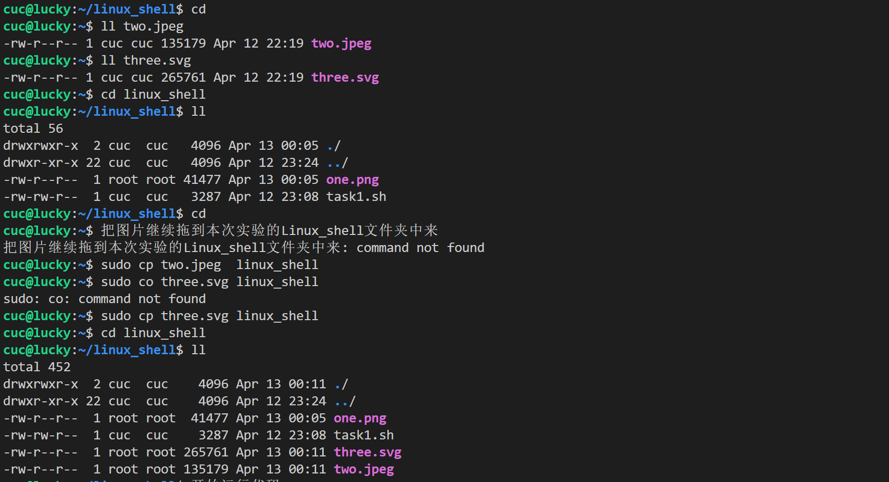

#### 二 . 编写脚本（详情见脚本文件）

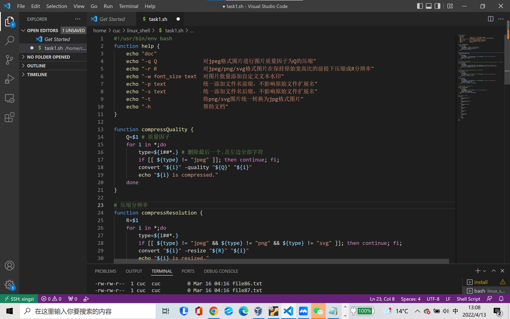

#### 三 . 运行代码，观察结果

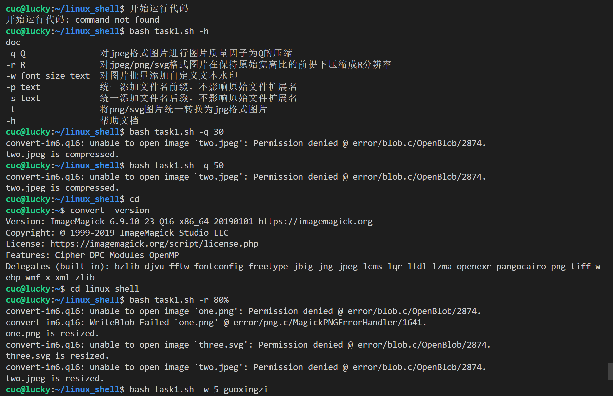

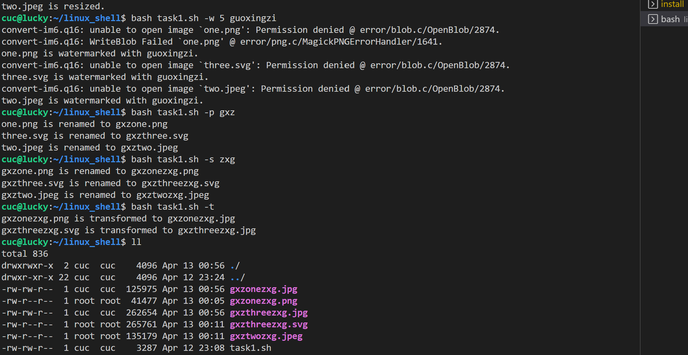

------

### 任务二：用bash编写一个文本批处理脚本，对以下附件分别进行批量处理完成相应的数据统计任务：

- ☑️统计不同年龄区间范围（20岁以下、[20-30]、30岁以上）的球员数量、百分比
- ☑️统计不同场上位置的球员数量、百分比
- ☑️名字最长的球员是谁？名字最短的球员是谁？
- ☑️年龄最大的球员是谁？年龄最小的球员是谁？

#### 一 . 用wget获取资料文件

```shell
wget "https://c4pr1c3.gitee.io/linuxsysadmin/exp/chap0x04/worldcupplayerinfo.tsv"
```

#### 二 . 查看task2.sh与所用的资料文件是否在同一文件夹内

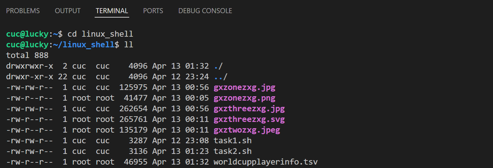

#### 三 . 编写脚本（详情见脚本文件）

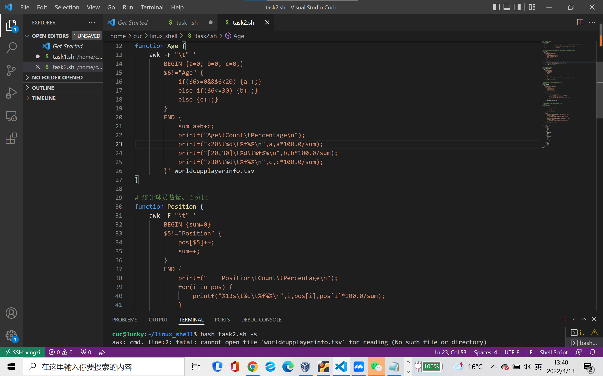

#### 四 . 运行代码，观察结果

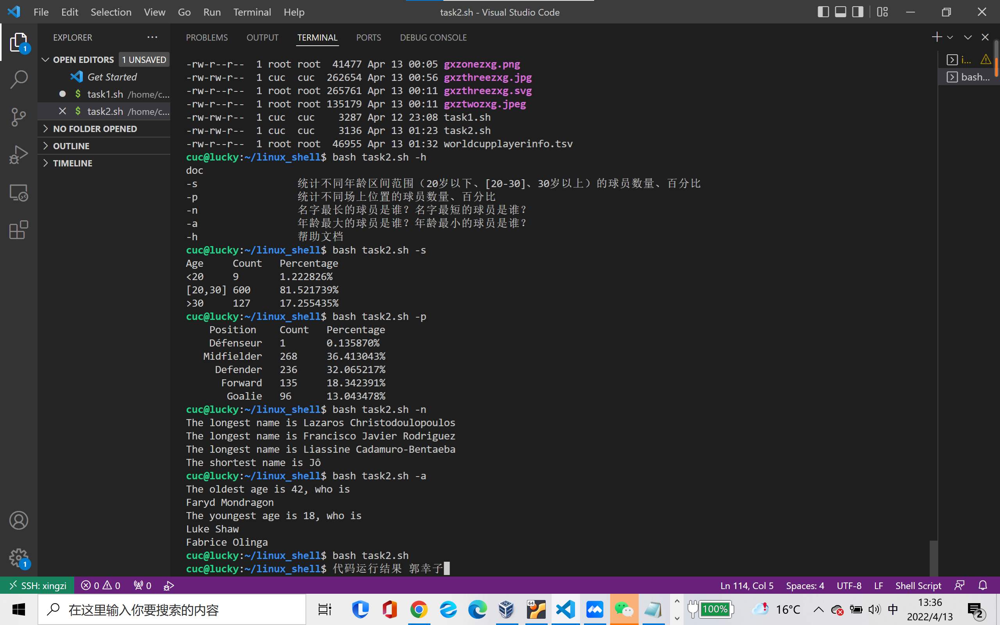

#### 五 . 编写结果报告（详情见结果附件）

------

### 任务三：用bash编写一个文本批处理脚本，对以下附件分别进行批量处理完成相应的数据统计任务：

- ☑️统计访问来源主机TOP 100和分别对应出现的总次数
- ☑️统计访问来源主机TOP 100 IP和分别对应出现的总次数
- ☑️统计最频繁被访问的URL TOP 100
- ☑️统计不同响应状态码的出现次数和对应百分比
- ☑️分别统计不同4XX状态码对应的TOP 10 URL和对应出现的总次数
- ☑️给定URL输出TOP 100访问来源主机

#### 一 . 用wget获取p7zip资料文件，并且注意解压，把解压缩后的文件与目标脚本放在一个文件夹

```shell
wget "https://c4pr1c3.github.io/LinuxSysAdmin/exp/chap0x04/web_log.tsv.7z"
7z x web_log.tsv.7z
```

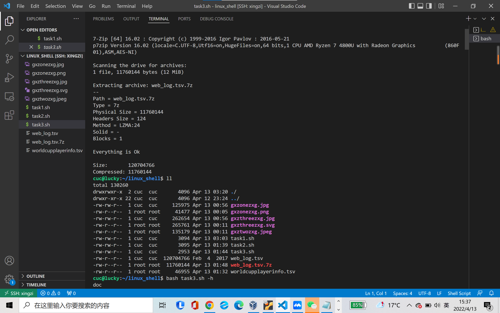

#### 二 . 编写脚本（详情见脚本文件）

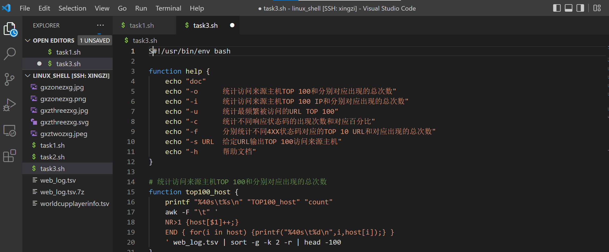

#### 三 . 运行代码，观察结果

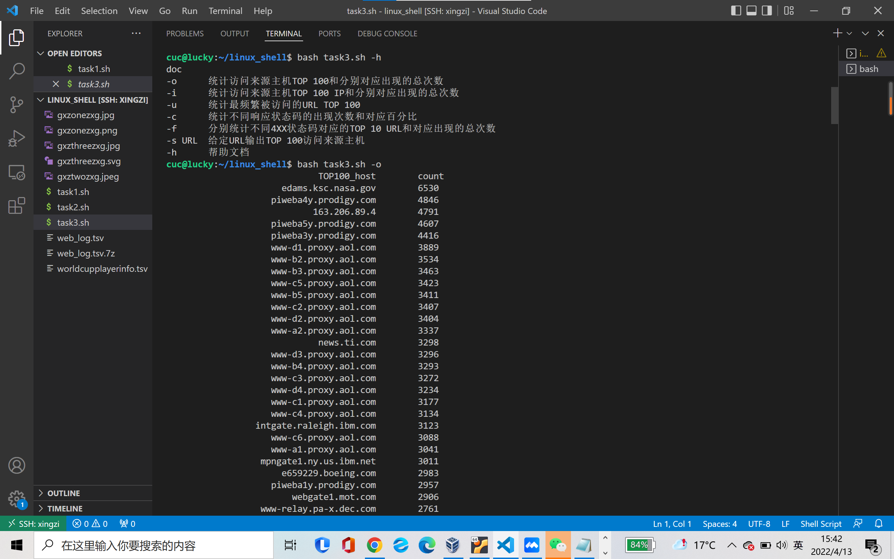

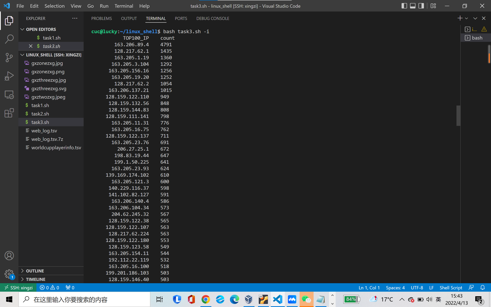

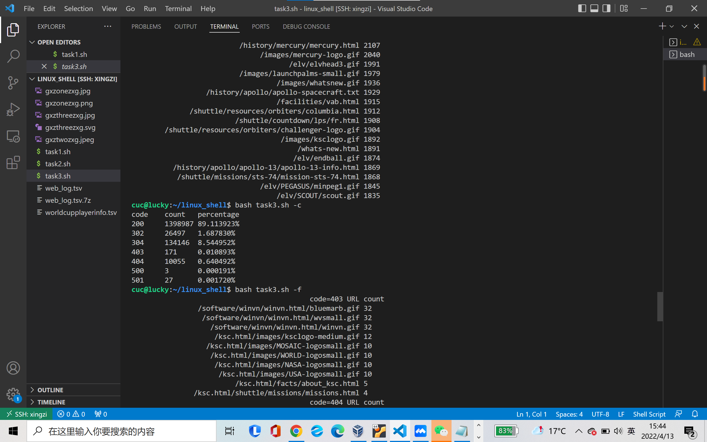

#### 四 . 编写结果报告（详情见结果附件）

------

## 遇到的问题

1. 运行任务一的脚本时，运行不出想要的结果，检查了一番之后发现。需要的图片与shell文件必须放在一个文件夹下面才可以运行成功。同理，在后面做任务二和任务三时，我都会注意把shell文件与需要的资料文件放在一个文件夹下之后再运行。
2. 在移动图片时，犯了一些低级错误。把本机桌面的图片通过scp传到虚拟机上时，在虚拟及环境下进行了。试了几次找不到文件，最后恍然大悟，在桌面gitbash中才成功。同时，把虚拟机桌面的文件移动到shell文件夹中时总是忘记切换文件夹。最终得出经验：一定要时刻注意自己所处在哪个环境下，处在哪个文件夹下。而自己的操作需要在哪。
3. 在代码部分，help文件中的字符一定要与函数名准确对应。有几次我修改了函数，导致函数名上下不符，不能调取函数成功。
4. 一些特殊符号不知道如何去处理。查找资料后尝试用通配符和双引号去识别。

## 参考资料

- [CUCCS/Linux-2020-LyuLumos](https://github.com/CUCCS/linux-2020-LyuLumos)
- [哔哩哔哩视频Linux网络管理](https://www.bilibili.com/video/BV1Hb4y1R7FE?p=67)
- [Ubuntu移动和复制文件夹到另一个文件夹](https://blog.csdn.net/ljl1015ljl/article/details/95380668)
- [Shell Scripting Tutorial](https://www.tutorialspoint.com/unix/shell_scripting.htm)
- [vscode环境配置](https://blog.csdn.net/qq_41169447/article/details/103912016)
- [Linux Shell 特殊字符](https://www.jianshu.com/p/ab18e947266b)